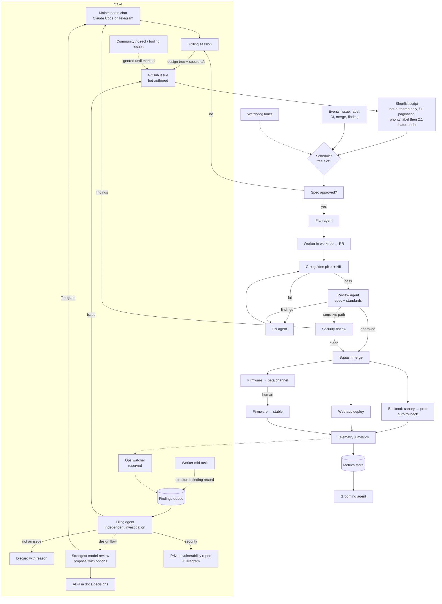

# Panelator development process specification

Status: settled principles as of 2026-10-02, with named open questions that
wait on the research run (section 9). Rationale and alternatives are in
[design-tree.md](design-tree.md), rounds 6 to 9.

This repo is developed mostly by AI agents. This document says how, and where
the human is.

## 1. Six separate pieces

These travel together under "AI-driven repo" and are kept apart on purpose,
because they have different owners and change at different speeds.

| Piece | What it is | Status |
|---|---|---|
| A. Product | The LED system itself | [product-spec.md](product-spec.md) |
| B. Repo internals | Structure, conventions, docs and specs layout, enforcement tooling | Tooling settled; docs/specs shape open (9) |
| C. Feature lifecycle | What happens end to end when a change is requested | Stages and gates settled; mechanics open (9) |
| D. Agent runtime | Harness, where agents run, triggers, model tiering, cost | Host and trigger model settled; harness open (9) |
| E. Measurement | How we know the process works | Candidate metrics listed; final set open (9) |
| F. Research | The investigation that closes the open items | Planned (9) |

C is a design we own regardless of harness. D is a procurement decision we can
revisit.

## 2. Goal state and the autonomy ladder

Goal: the project runs itself, including triaging and shipping requests, with
the maintainer as reviewer of last resort. That is reached by a ladder, not a
switch: a class of change (dependency bumps, widget fixes, ...) earns more
autonomy when the measurements in section 7 show low rework and low escape rate
for that class.

v0 position on the ladder: the maintainer is in the loop at **one** gate,
requirements grilling. Everything else is agent-run, with the release safety
rules in section 5.

## 3. Lifecycle stages and artifacts

| Stage | Artifact | Who |
|---|---|---|
| Intake | GitHub issue | see section 4 |
| Triage | labels, dedupe, change class (product / bug / tooling / dependency) | agent |
| Grilling | design tree as issue comments | maintainer + agent |
| Spec | markdown in `specs/` with acceptance criteria and out-of-scope | agent drafts; maintainer approves |
| Plan | ordered tasks with file-level scope | agent |
| Implement | a PR per plan, in a worktree | agent |
| Verify | CI, golden pixel tests, HIL when firmware changes | automated |
| Review | agent code review against spec and standards, fix loop | agent |
| Merge | squash merge | agent |
| Release | deploy backend, publish firmware to a channel, deploy web app | automated, see 5 |
| Observe | telemetry and metrics flow back into measurement | automated |

Mechanics of each stage (prompts, briefs, labels, retries) are designed after
the research run.

## 4. Intake tracks

Two tracks in v0. Community-filed issues are deferred as a track, but the
public tracker cannot prevent them, so section 4.3 defends against them.

### 4.1 Maintainer track

- Product direction (what the product is, its high-level goals) changes only
  through the maintainer. Community suggestions may inform that, but the
  decision is the maintainer's.
- The maintainer files through chat, always: Claude Code at the desk, or a
  Telegram bot backed by a harness session on the laptop when away.
- Intake and grilling happen in that chat. The session ends by posting the
  design tree and spec draft to a new GitHub issue, which is the system of
  record. Issues created this way are validated by construction.

### 4.2 Agent track (findings)

Agents notice tech debt, bugs and design smells while working. Capturing these
is how the product hardens over time, but issues carry authority with agents,
so validation happens **before** anything becomes an issue.

1. A worker mid-task writes a **structured finding record** to a findings
   queue: what, where, evidence, suspected root cause, how it was noticed. The
   worker then continues on its spec. No side quests.
2. A **filing agent** later investigates independently, with the architecture
   docs and ADRs loaded, asking step-back questions: is this a symptom of
   something more fundamental, is it actually an issue, does it fit the larger
   design. Outcomes:
   - **not an issue**: recorded with reason, discarded;
   - **issue**: filed, validated, enters the shortlist;
   - **possible design flaw**: escalated.
3. **Escalation**: a review session on the strongest available model produces
   a short proposal with options. It reaches the maintainer on Telegram. The
   maintainer decides in chat, which may itself become a grilling session that
   yields a spec. Whatever is decided is recorded as an ADR in
   `docs/decisions/`. The in-flight task that surfaced the flaw continues as
   specced unless the flaw blocks it.
4. **Security findings** are classified separately and routed to GitHub private
   vulnerability reporting plus a Telegram alert. Never the public tracker.
   Fixes go through the sensitive-path review (section 5).

### 4.3 Issue authority

The shortlist script works only issues authored by the pipeline's bot account
(grilling output and filing-agent output). Everything else on the public
tracker (community, maintainer typing directly into GitHub, Renovate, CI
reporters, future producers) is ignored until a human or the filing agent marks
it. This is enforced in the script, not in a prompt.

### 4.4 Reserved: ops as a producer

Production telemetry, backend errors, HIL failures and marketplace reports are
a real source of bugs. They enter through the **same findings queue and the
same filing agent** as worker findings. An ops watcher is just another
producer. Not implemented in v0; the slot is reserved and must not be lost.

### 4.5 Prioritisation

One shortlist for both tracks. A maintainer-set priority label always wins.
Otherwise a 2:1 feature-to-debt ratio. The ratio is itself a metric so debt
accumulation is visible.

## 5. Release safety with no human merge gate

The project ships firmware to strangers' boards and runs a backend holding
their data, so autonomy is bounded by:

- Backend deploys to production automatically behind a canary with automatic
  rollback on error rate. Web app deploys automatically.
- Firmware publishes to the **beta** channel automatically. Promotion to
  **stable** is the one human release action, until the HIL rig and the
  escape-rate metric justify automating it. Bricking a stranger's board is the
  system's one irreversible failure.
- **Sensitive paths**: auth, the WASM sandbox host, provisioning, the relay,
  and the automation itself. Changes there require a dedicated security review
  by the review agent; anything it flags blocks merge until the maintainer
  looks.
- Changes to the automation need a human-approved spec, always. The pipeline
  does not modify its own rules unsupervised (this is where drift came from in
  the predecessor system).

## 6. Agent runtime

### 6.1 Host

Agents run on the maintainer's laptop (also the HIL rig and the existing GitHub
self-hosted runner). The predecessor system on the same machine recorded these
failure modes, which must be addressed explicitly, not inherited: suspend
breaking runs, memory pressure from leftover dev stacks and OOM kills taking
down a whole tick, workers killed by timeouts, a clone running stale code for
17 hours.

### 6.2 Trigger model: pull on completion

The backlog is never empty, so pure event-driven scheduling is the wrong model.
Instead: a worker with a concurrency slot. Events (new issue, label applied,
CI finished, PR merged, findings queued) wake a scheduler; the scheduler fills
any free slot from the ranked shortlist. A slow timer exists only as a
watchdog for missed events. Work starts on completion of the previous item,
not on a clock.

### 6.3 Telegram

A persistent long-polling process on the laptop (systemd user service), not a
poll inside a dispatcher tick: the predecessor's sluggishness was its 15-minute
timer, not the transport. Telegram holds undelivered updates for 24 hours if
the laptop is asleep. No server-side receiver is needed. Carries: intake and
grilling conversations, escalations, security alerts, status and pause.

### 6.4 Completeness principle

Agents never list anything from GitHub themselves. Deterministic scripts do the
listing with full pagination, assert completeness against the reported total,
and fail loudly if truncated. Agents receive a result they can trust or an
error they cannot ignore. (The predecessor hit a case where the issue list
silently omitted the oldest items.)

### 6.5 Kept from the predecessor (kari-website)

Model tiering by stage (strongest model for judgment: validation, planning,
review; cheaper for implementation and fixes). Cost-capped fallback retry on
rate limits only. Per-run usage records. The idea of brief templates per role.
Everything else awaits the research run.

### 6.6 Harness selection criteria

Open source; runs headless in CI on our own runner; model-agnostic, with a
wide variety of models pluggable; skills or an equivalent extension mechanism;
cost controls and usage reporting; coexists with interactive Claude Code use.
Model-agnostic and headless are the hard requirements. Candidates: pi, Claude
Code headless with the Agent SDK, Codex CLI, OpenCode. Evaluation must include
running one real task through each on this repo, using Anthropic and OpenAI
models (existing subscriptions), not reading feature lists.

## 7. Measurement (piece E)

Candidate metrics, each tied to the decision it drives. Final set open pending
research.

| Metric | Drives |
|---|---|
| Rework rate (fix cycles per PR) | which change classes earn more autonomy |
| Spec deviation (review findings about scope or missed criteria) | spec template quality |
| Spec churn (edits after approval) | whether grilling missed something |
| Time to green per PR | tooling and CI investment |
| Cost per merged PR, by model and stage | model tiering |
| Product vs. machinery ratio of merged PRs | the section 5 guard (predecessor measured two thirds machinery) |
| Defect escape rate (bugs against features shipped in last 30 days) | verification depth, stable promotion |
| Human interventions per PR | progress toward the goal state |
| Feature-to-debt ratio actually worked | prioritisation |
| Queue age, lead time issue to production | capacity |

Proposed storage: raw events in the backend's Postgres, a report page in the
web app's admin area, and the grooming agent reads the numbers.

## 8. Agent flow

## 9. Open items and the research plan

### 9.1 Open items

- B: the exact `docs/` and `specs/` shape, spec template, how agent guidance
  (AGENTS.md-style files) is kept current, ADR format.
- C: mechanics of each stage; label protocol; brief templates; fix-loop limits;
  how the grilling bot posts to issues.
- D: harness; agent definition format; how findings are queued; Telegram bot
  implementation; token efficiency techniques; addressing the laptop failure
  modes.
- E: final metric set and thresholds for the autonomy ladder.

### 9.2 Research run

Fact-finding by parallel agents, one per piece B, C, D, E. Sources: published
writeups, harness documentation and source, and the predecessor system's own
records (`kari-website/automation/`, its README of recorded failures, its
issue-pipeline playbook). Questions to answer:

- How to structure specs so agents implement them faithfully.
- What makes a codebase navigable for agents: module depth, naming, file size,
  tests as documentation.
- Which linting and architecture-enforcement tools catch drift automatically
  across TypeScript, Rust and C.
- How to run agent code review and verification gates.
- How to keep agent guidance files current.
- What others have published about multi-language monorepos maintained mostly
  by agents.
- Token and cost efficiency: caching, context trimming, model routing per
  stage, limits.
- Harness evaluation against section 6.6, including a real task through each.
- How to measure whether it is working.

Output: one synthesis document that explicitly separates **what others do**
from **open questions**, so that innovation in the thinking run is deliberate.

### 9.3 Thinking run

A grilling session over the open questions, where novel methods are proposed
and stress-tested. Design decisions are the maintainer's. Nothing is built
until both runs land.
